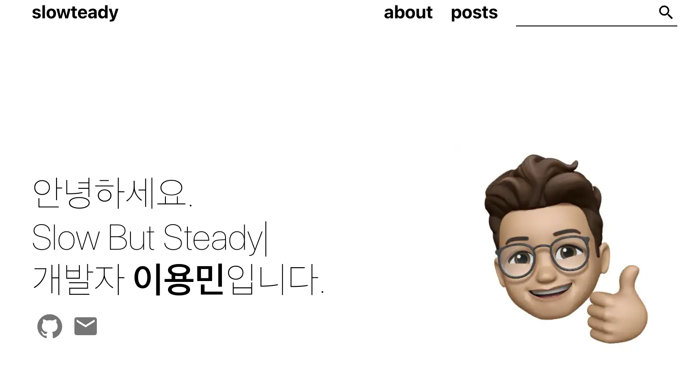
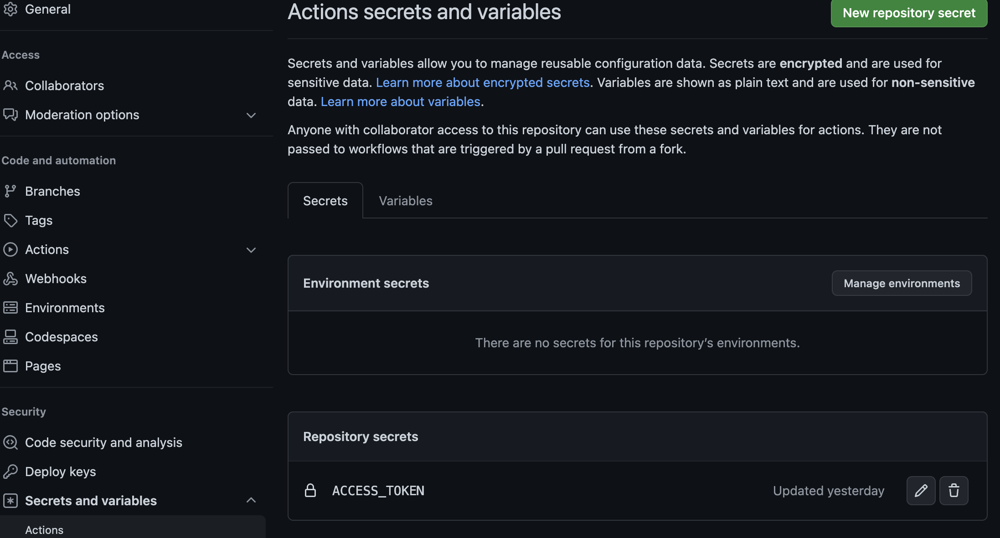
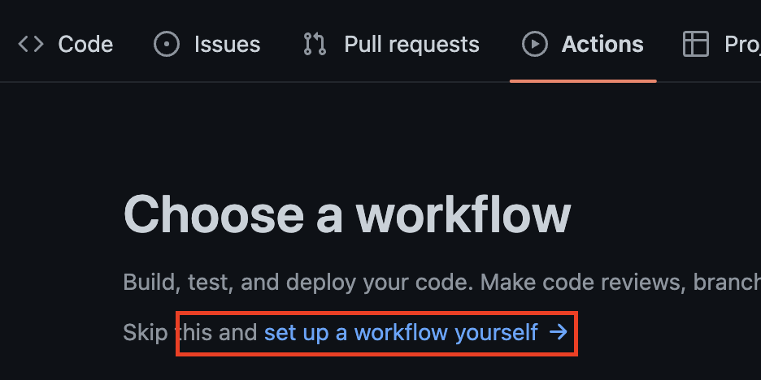

최근에 개발 블로그의 필요성을 느꼈다.

리액트 공부를 시작하면서 머릿속에 새로운 개념들이 중구난방으로 퍼져있어서 개념이 정립되지 않았다.

정확한 이해를 위해 중간중간 정리를 해야할 필요성을 느꼈고, 블로그를 해야겠다는 생각이 들었다.

***

## 1. Github Pages & Gatsby

정말 많은 블로그 플랫폼이 있다. 노션, 티스토리, 벨로그 등등

취향껏 고를 수 있게 각각 특색이 있었다.

그중에 내가 고른 플랫폼은 깃헙 블로그이다.

정해진 범위 내에서의 커스텀이 아닌 전체를 커스텀 할 수 있다는 점, 소스를 표현하기 쉽다는 점이 매력적이었다.

깃헙 페이지스에서 호스팅 서비스를 제공하기 때문에 구축이 어렵지 않았다. 😀

깃헙 페이지스가 호스팅 서비스를 제공하니 페이지 파일들을 만들어주면 되는데, 정적 사이트 생성기를 이용하면 보다 편하게 파일을 생성할 수 있다.

대표적으로 Jekyll과 Gatsby가 있다.

지킬은 Ruby를 기반으로 동작하고 개츠비는 React와 GraphQL를 기반으로 동작한다.

학습중인 리액트를 사용할 기회도 있고 나만의 디자인으로 이루어진 블로그를 만들어 볼 욕심도 있어서 개츠비를 선택했다.

*** 

## 2. 설치
### 2-1. Template 생성
이미 다양한 템플릿들이 패키지로 많이 나와있다.
지금은 빠르고 간단하게 사용하고 싶기 때문에 템플릿을 이용했다. 

[줌코딩](https://github.com/zoomkoding/zoomkoding-gatsby-blog)님의 템플릿이 마음에 들어서 사용했다.   

> 🙋🏻‍♂️ 오래된 템플릿 사용 시, package.json의 dependency끼리 충돌이 일어나 오류가 생길 수 있다.   
> 이 경우, 버전을 하나씩 맞춰가면서 수정해주거나 npm의 --force 옵션 등을 이용하여 해결해야한다.

다른 스타일의 템플릿을 원한다면 [Gatsby Starters](https://www.gatsbyjs.com/starters)를 이용하면 된다.

ㅇ **템플릿 설치**
```bash
npm install gatsby-cli
gatsby new blog-start https://github.com/zoomkoding/zoomkoding-gatsby-blog
```

ㅇ **npm start**
```bash
cd blog-start
npm start
```

### 2-2. Repository 생성
**${github_id}.github.io**  의 형태로 레포지토리를 생성한다.


### 2-3. git push
내 레파지토리에 push를 해준다.
```bash
git add .
git commit -m "blog start"
git remote add origin https://github.com/${github_id}/${repository_name}.git
git push -u origin main
```
***

## 3. 배포
깃헙 페이지스로 바로 deploy 시키면 컴파일된 파일들로 덮어 씌워지기 때문에 branch를 만들어야한다.

ㅇ **gh-pages 설치**
```bash
npm install gh-pages --save-dev
```

ㅇ **package.json에 script 추가** 
```json
{
  "scripts": {
    "deploy": "gatsby build && gh-pages -d public" 
  }
}
```
ㅇ **명령 실행**
```bash
npm run deploy
```
를 사용하여 배포할 수 있다.

## 4. 배포 자동화
npm run deploy 명령어를 통해 배포할 수 있지만
수정 할 때 마다 명령을 실행해주기에는 은근히 귀찮고 번거롭다.

Github Action을 통하여 배포 자동화를 해주면, 커밋 할 때 마다 자동으로 배포가 된다.

**settings > Developer settings > Tokens** 메뉴로 간다.


**Generate new token > repo** 부분을 체크 후 토큰을 생성하고 token value를 복사하여 저장한다.
> 🙋🏻‍♂️ token value는 재발급이 안되기 떄문에 꼭 복사해야한다!!



**블로그 repository > settings > secrets and variables > Action** 메뉴에서
**New repository secret**을 클릭, 변수로 사용할 이름을 지정하고 token value를 내용으로 추가하여
secrets을 추가시켜준다.



**블로그 repository > Actions**로 이동하여 **set up a workflow yourself**를 클릭한다.


main.yml 이름으로 생성하고, 트리거를 실행할 branch를 선택한다.

```bash
name: Gatsby Publish
on:
  push:
    branches:
      - main
jobs:
  build_gatsby:
    name: deploy
    runs-on: ubuntu-latest
    steps:
      - uses: actions/checkout@v1
      - uses: actions/setup-node@v3
        with:
          node-version: '18.x'
      - uses: enriikke/gatsby-gh-pages-action@v2
        with:
          access-token: ${{ secrets.ACCESS_TOKEN }}
          deploy-branch: gh-pages
```
위와 같은 형식으로 설정 해주면되고

secrets.ACCESS_TOKEN은 설정한 secrets 변수 이름과 맞춰주면 된다.


git push후 정상적으로 동작하는지 확인한다.

***

ㅇ **참고자료**

 * [gparkkii님 글](https://velog.io/@gparkkii/build-gatsby-blog)
 * [줌코딩님 글](https://www.zoomkoding.com/gatsby-starter-zoomkoding-introduction/)
* [유림님 글](https://milooy.github.io/build-blog-with-gatsby/)


```toc

```